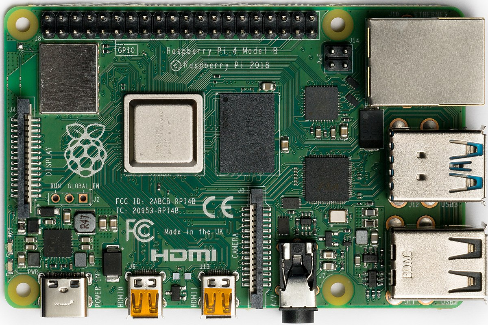
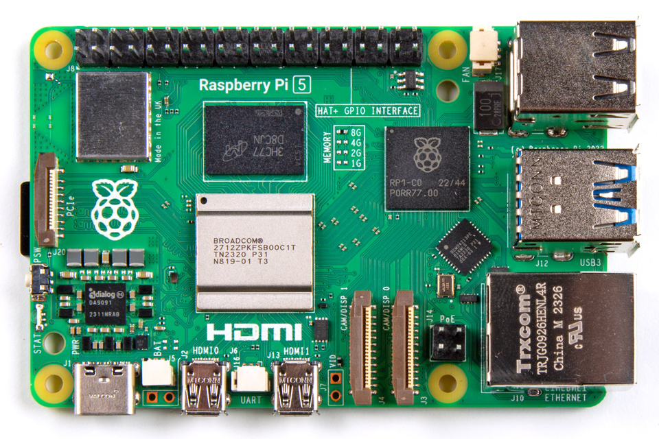

# How to Identify the Raspberry Pi Model Number
Somebody found out you're doing a Raspberry Pi lab. They know a guy, who knows a kid, who's got a drawer full of old Pis at home. Those Pis are now in a box and it's sitting on your desk.

As you begin to question the life choices that led you here, you might be wondering, _Is that box of Pis even any good?_

Read on and find out.

## Visual Inspection
You can tell a lot about the generation of Raspberry Pi just by looking at it. All recent boards have the model number silkscreened under the GPIO header (the double row of pins on one edge.

### Raspberry Pi 3
If it looks like the picture below, it's a Raspberry Pi 3. You can even see the white lettering silkscreened on the board indicating it's a Model B+.

Other notable clues are the single, full-size HDMI port and the USB Micro-B power port (both at the bottom of the picture.) The 3rd generation Raspberry Pis also have their RJ45 network port on the same side (bottom edge) as the HDMI port. The USB ports will be on the same side as the GPIO header.


_Photo by: Gareth Halfacree from Bradford, UK, CC BY-SA 2.0 <https://creativecommons.org/licenses/by-sa/2.0>, via Wikimedia Commons_

### Raspberry Pi 4
The photo below shows a Raspberry Pi 4. It's very similar to the Pi 3, but notable differences include the dual micro-HDMI ports in place of the single standard HDMI, and also the RJ45 network port / USB port arrangement is mirrored compared to the Pi 3. The power connector is also different, being a more modern USB-C type on the Pi 4.



_Photo by: Laserlicht / Wikimedia Commons_

### Raspberry Pi 5
If your Pi looks like the picture below, someone likes you a lot. This is the new, and rather expensive, Raspberry Pi 5. It's identifiable by the same micro-HDMI video and USB-C power ports as the Pi 4. But, the USB / RJ45 layout has returned to the style used in the Pi 3.



_Photo by: SparkFun Electronics, CC BY 2.0 <https://creativecommons.org/licenses/by/2.0>, via Wikimedia Commons_

### Other Pi
If you're not looking at something like one of the pictures above, chances are good it's not what you want. The only exception is the Raspberry Pi 400 which is a computer built into a red and white keyboard. It's less common, but works the same as a Pi 4. If you've got one, hang on to it.

## Software Inspection
You'll need to use a Micro SD card with Raspberry Pi OS for this.

1. Attach the Pi to power, keyboard, mouse, and monitor.
2. Boot and start a terminal.
3. Display the contents of the file: /proc/cpuinfo
4. Take note of the last few lines. 

Here's an example of an older Raspberry Pi 2
```
$ cat /proc/cpuinfo
[output removed for brevity]
Hardware        : BCM2835
Revision        : a21041
Serial          : 0000000077b30e4e
Model           : Raspberry Pi 2 Model B Rev 1.1
```

For more detailed information, cross-reference with the list in this article: https://www.raspberrypi-spy.co.uk/2012/09/checking-your-raspberry-pi-board-version/
