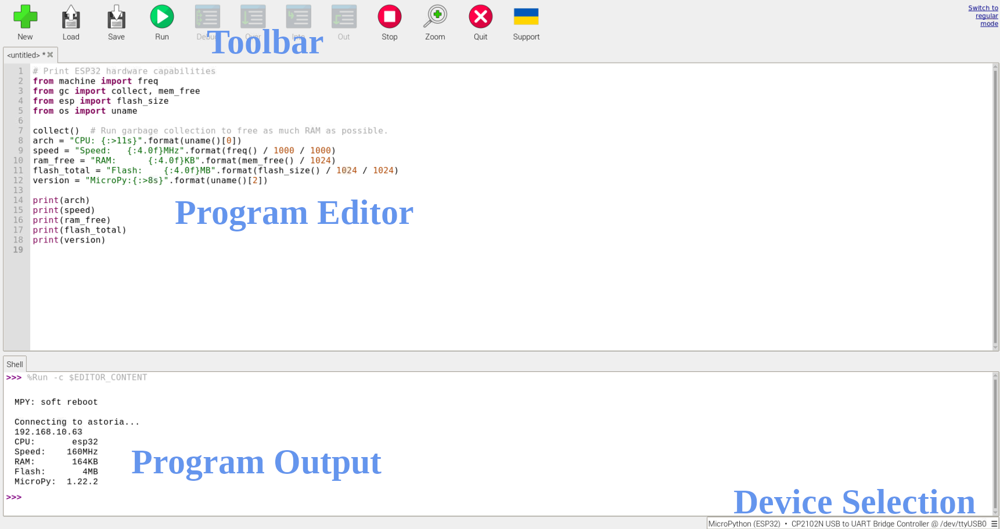
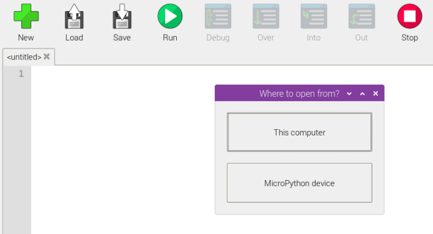

# Code Editors
Before you can run code, you have to write code. For that, you need a code editor. There are many options, but for Python and MicroPython, Thonny is an excellent choice. And, comes pre-installed with Raspberry Pi OS, so you can start coding right away.

## Thonny in Five Minutes
Thonny can be accessed from the Raspberry Pi OS application menu as shown in the screenshot below.

_Figure 1: Accessing Thonny from the Application Menu_

___

Below is a screenshot of what it looks like while working on a typical MicroPython program.

_Figure 2: Thonny Running a MicroPython Program_

There are four main areas to be concerned with. From top to bottom, these are:

1. The toolbar. This is where you do things like saving your files and loading previous ones.
2. The program editor. This is where you type in your code.
3. The program output. This is where you see the results of your code when you run it.
4. The device selection pop-up menu. Clicking here lets you choose the microcontroller you have attached.

___

Whenever you use the Load or Save buttons with a microcontroller attached, you'll be asked to select from the _This Computer_ or the _MicroPython Device_.

A sample screenshot is shown below.

_Figure 3: This Computer or MicroPython Device_

When you choose _This Computer_, you'll be accessing files on your development machine, the Raspberry Pi. When you choose _MicroPython Device_, you'll be accessing the files on the microcontroller's flash storage.

___

Once you have loaded or typed in your program, click the big green play button on the toolbar to run it.

Check in the program output area to see the results.

___

And that's your five minute introduction to using Thonny to write MicroPython code. To learn more about Thonny, visit their home page at: https://thonny.org
