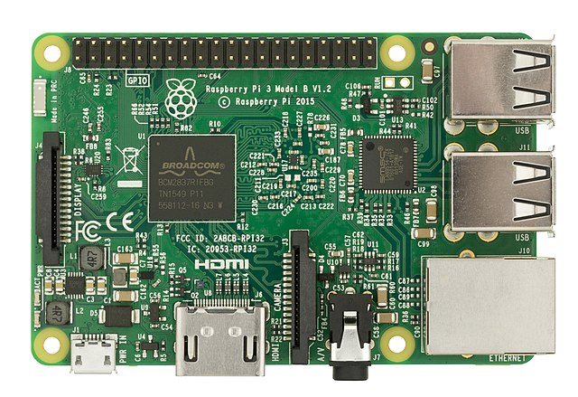

# How to Identify Your Raspberry Pi Model Number
Somebody found out you're doing a Raspberry Pi lab. They know a guy, who knows a kid, who's got a drawer full of old Pis at home. Those Pis are now in a box and it's sitting on your desk.

As you begin to question the life choices that led you here, you might be wondering, _Is that box of Pis even any good?_

Read on and find out.

## Visual Inspection
You can tell a lot about the generation of Raspberry Pi just by looking at it. All recent boards have the model number silkscreened under the GPIO header (the double row of pins on the top edge.) The one in the picture below is a Raspberry Pi 3 Model B V1.2.

___



_Public Domain Image of Raspberry Pi 3_

___

Most modern Raspberry Pis are about the size of a credit card and look like the photo with a few minor differences in the HDMI and USB port arrangement. If the board you're looking at is quite a bit smaller, has fewer than four USB ports, or has fewer than four mounting holes, it probably won't be suitable for building a lab computer.

The notable exception is the Raspberry Pi 400 which is a computer built into a red and white keyboard. It's less common, but if you've got one, hang on to it. It can do everything a Raspberry Pi 4 can do.

## Software Inspection
Alternatively, you can find out about the Raspberry Pi model from the Raspberry Pi OS terminal prompt. Honestly, it's easier just to read the silkscreening on the board, but if you're so inclined, read on.

You'll need to use a Micro SD card with Raspberry Pi OS for this.

1. Attach the Pi to power, keyboard, mouse, and monitor.
2. Boot and start a terminal.
3. Display the contents of the file: /proc/cpuinfo using the command: `cat /proc/cpuinfo`
4. Take note of the last few lines. 

Here's an example from a Raspberry Pi 3 like the one in the photo:
```
$ cat /proc/cpuinfo
[output removed for brevity]
Hardware        : BCM2835
Revision        : a020d3
Serial          : 000000decafc0fee
Model           : Raspberry Pi 3 Model B Plus Rev 1.2
```

> For more detailed information, you can run the command `pinout` in a terminal window.

## Model vs. Performance
Knowing the model number of your Raspberry Pi board will give you a better idea of what kind of performance you can expect. On the low end, the Raspberry Pi 2 started shipping in 2015. It's still usable, but a lot has changed over the years since its release. Contrast 2015's Pi 2 with the Raspberry Pi 4 that first shipped in 2019 and you'll see a number of improvements.

The CPU speed continually improves over the revisions from Pi 2, to Pi 3 to Pi 4. But most notable is the amount of memory. Raspberry Pi 2 and 3 have 1 Gi of RAM. Raspberry Pi 4 can have up to 8 Gi, with 2 Gi and 4 Gi being most common. More RAM equals better performance.

Running the command `free -h` in a terminal window will let you know how much memory is installed. For example, on a Raspberry Pi with 4Gi of RAM, it will look like this:

```
$ free -h
               total        used        free      shared  buff/cache   available
Mem:           3.7Gi       961Mi       1.2Gi       0.0Ki       1.5Gi       2.7Gi
Swap:           99Mi        77Mi        22Mi
```

You're interested in the row labled _Mem:_ and the column _total_. In the example you will see 3.7Gi. This indicates 4G of RAM on the Pi. The actual number displayed by the command will always be a little lower, so rounding up is required. On a 1G RAM Pi, you will see something like 920Mi. Nine-hundred twenty megabytes, which is slightly less than 1Gi. (There are 1024 Megabytes in a single Gigabyte.)

If you have more donated Raspberry Pis than you know what to do with, use this information to prioritize which ones will be used for the student development workstations.
