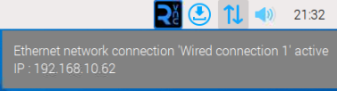
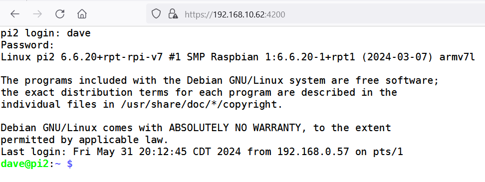

# Accessing Your Raspberry Pi from Another Machine
Most of the time, you'll use a keyboard, mouse and monitor to access the Raspberry Pi computer you're using. But, you don't have to. You can also interact with it using a remote access client. We'll look at two methods of remote access, Virtual Network Computing (VNC) and Secure Shell (SSH).

## Using VNC to Access Your Desktop
The advantage of VNC is, it's nearly identical to the experience of sitting in front of you monitor and keyboard. The drawback is, you need a VNC client installed on the computer you want to use to access the Raspberry Pi.

On Windows, you can install VNC Viewer from RealVNC to access your Raspberry Pi. If you're using a Chromebook, you're out of luck. Technically, you can use Chromebook's Linux Mode to install a VNC client, but if you had access to Linux Mode on your Chromebook, you probably wouldn't be building a Raspberry Lab.

To use VNC on your Raspberry Pi, you'll need to enable it first.
1. Open a terminal window.
2. Type the command: `sudo raspi-config` and hit Enter.
3. Choose _Interface Options_
4. Choose _VNC_
5. Say _Yes_ to enable.

> Note: VNC can use a different screen size than your regular monitor. To change it, use `sudo raspi-config` look under _Display Options_.

## Using Secure Shell to Access a Terminal
The terminal window we've been using so much in the set up of your Raspberry Pi is also available remotely. It's more primative, with no graphical desktop, but it does offer some flexibility. One big advantage is using a web-based Secure Shell terminal.

>If you used the Raspberry Pi Imager to write your Micro SD card and you checked the box for Enable SSH on the Services tab of OS Customization, Secure Shell is already available. If you forgot, use `sudo raspi-config` and look under _Interface Options_ for _SSH_ and activate it there.

Like VNC, you'll need a client program to access your Raspberry Pi via Secure Shell. With Windows, Linux, and Mac machines, this capability is built into the operating system. Just open a terminal window and type `ssh 192.168.1.1`; where 192.168.1.1 is the IP address of your Raspberry Pi. With Chromebooks and no access to Linux Mode, things are more difficult. (Are you sensing a theme here?)

For Chromebooks, we'll need to make SSH available through a web browser. This is covered next.

> You can find your Raspberry Pi's IP address using the command `ifconfig` or by hovering the mouse pointer over the up/down arrow in the upper right corner of the Raspberry Pi OS desktop.
>
> 
> 
> _Figure 1: IP Address Shown on Raspberry Pi OS Desktop_

## Secure Shell in a Web Browser
With the help of some software on the Raspberry Pi, you can access Secure Shell in a browser window. Even Chromebooks will let you use a web browser, so this should give you remote access to your Raspberry Pi, just without the graphical desktop.

The software package we need is called _shellinabox_ and it can be installed with the command `sudo apt-get install shellinabox`.

Once it's installed, it should start up automatically and you can access Secure Shell using a web browser address similar to _https://192.168.1.1:4200_

Replace 192.168.1.1 with the IP address of your Raspberry Pi, but keep the :4200 part. You should be asked for a username and password. Once you're logged in, your browser will look similar to the screenshot below.

_Figure 2: Shell in a Box, in a Browser_

## Next Steps
Remote access is handy for running administrative tasks without having to be sitting at the machine. With Secure Shell access to the Raspberry Pi, you also have the option of automating system tasks from a central management machine. This is an advanced topic, but is worth learning if you're trying to manage more than a handful of Raspberry Pis. If you're interested, take a look at [Ansible Community Edition](https://docs.ansible.com/ansible/latest/installation_guide/intro_installation.html).
